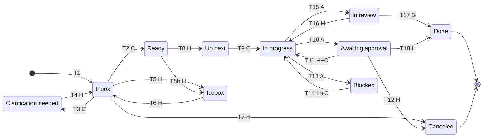
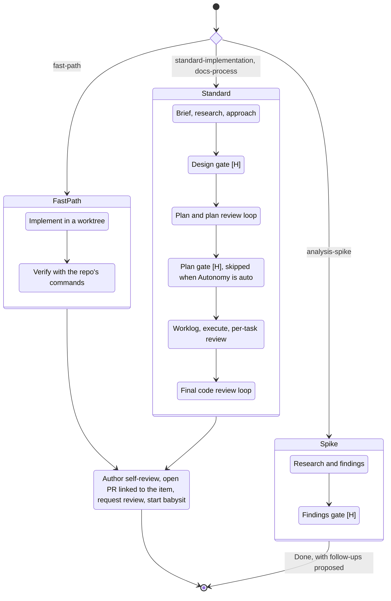
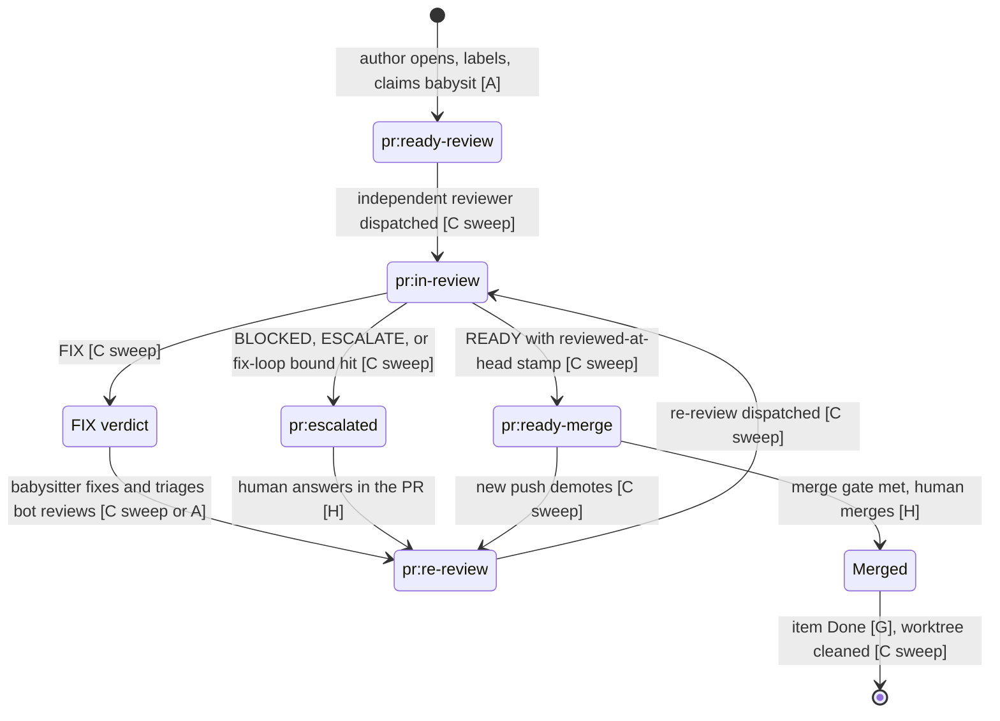
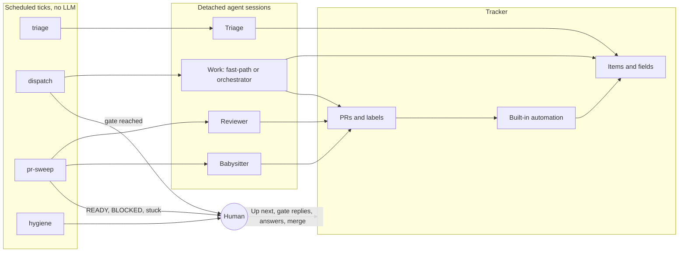

# Delivery Pipeline

How one backlog item moves from `Inbox` to a PR that is ready for the human to
merge, and which transitions are made by the human, by an agent in session, or
by a scheduled job. This doc is the state machine that ties together
[Task Tracking](task-tracking.md) (the item), the
[Development Process](../process.md) (the work), and the
[PR Review Process](pr-review.md) (the PR). Those docs stay canonical for their
own rules; this one defines only the states, the transitions, and who fires them.

Repos adopt it by mapping each state and hook to their tracker and scheduler. A
repo without automation runs the same machine by hand: every `[C]` transition
below can be done by a human or an in-session agent.

---

## Actors

| Tag | Actor | Examples |
|-----|-------|----------|
| `[H]` | Human owner | Selects work, answers gates, merges |
| `[A]` | Agent in a working session | Moves its own item at each stage boundary |
| `[C]` | Scheduled job (cron) that dispatches a fresh agent session | Triage, work pickup, PR review, babysit |
| `[G]` | Tracker automation built into the platform | Close issue on merge |

Scheduled jobs follow the [PR automation](../hermes/pr-automation.md) pattern:
the tick is a deterministic script with no LLM call, reads tracker state,
and launches detached agent sessions. The tick never does the work inline.

---

## Item fields

These extend the [recommended vocabulary](task-tracking.md#recommended-vocabulary).

| Field | Values | Set by |
|-------|--------|--------|
| Status | `Inbox`, `Clarification needed`, `Ready`, `Up next`, `In progress`, `Awaiting approval`, `In review`, `Blocked`, `Icebox`, `Done`, `Canceled` | See transitions |
| Stage | `Design`, `Plan`, `Execute`, `PR` | The working agent, at each stage boundary |
| Autonomy | `gated` (default), `auto` | Human; triage may propose |
| Track | `fast-path`, `standard-implementation`, `analysis-spike`, `docs-process` | Triage |
| Priority, Kind, Origin | As in task tracking | Triage fills gaps |

`Awaiting approval` means an agent reached a gate and is waiting on the human.
It is the human's review queue: filter the board on it.

---

## 1. Item lifecycle

Edge labels name the actor; the table below gives each transition's trigger.

| # | From → To | Actor | Trigger |
|---|-----------|-------|---------|
| T1 | new → `Inbox` | H, or A after human approval | Capture. Agents ask before creating items |
| T2 | `Inbox` → `Ready` | C triage | Item meets the Definition of Ready; empty fields filled |
| T3 | `Inbox` → `Clarification needed` | C triage | Gaps found; questions posted on the item |
| T4 | `Clarification needed` → `Inbox` | H, then C triage | Human answers on the item; re-triaged next tick |
| T5, T5b | `Inbox` / `Ready` → `Icebox` | H | Defer |
| T6 | `Icebox` → `Inbox` | H | Revive |
| T7 | `Inbox` → `Canceled` | H | Reject |
| T8 | `Ready` → `Up next` | H | Select for work. The only gate on *what* is worked |
| T9 | `Up next` → `In progress` | C dispatch | Pickup under the WIP limit |
| T10 | `In progress` → `Awaiting approval` | A | Gate reached; gate comment posted ([§3](#3-gate-protocol)) |
| T11 | `Awaiting approval` → `In progress` | H, then C dispatch | `approve` or `revise:` reply; session resumed |
| T12 | `Awaiting approval` → `Canceled` | H | `reject` reply |
| T13 | `In progress` → `Blocked` | A | External blocker, recorded on the item |
| T14 | `Blocked` → `In progress` | H, then C dispatch | Unblock reply; session resumed |
| T15 | `In progress` → `In review` | A | PR opened and linked to the item |
| T16 | `In review` → `In progress` | H | Rework beyond the PR's scope |
| T17 | `In review` → `Done` | G | PR merged; item closes |
| T18 | `Awaiting approval` → `Done` | H | Spike findings accepted |

Rules:

- **Triage may move** `Inbox` → `Ready` or `Clarification needed` and fill
  empty fields. `Icebox` and `Canceled` stay human decisions.
- **`Up next` stays human-controlled.** It is the only gate on *what* gets worked.
- **Agents still ask before creating items** (task-tracking capture policy).
  Follow-ups proposed during work are listed on the item or PR for the human to
  approve in one comment.

---

## 2. Work inside `In progress`, by track

Gates:

| Gate | Track | Human reviews | Skippable |
|------|-------|---------------|-----------|
| Design | standard, docs | Brief and approach together, in one approval | No |
| Plan | standard, docs | Reviewed plan | Yes, when Autonomy is `auto` |
| Findings | spike | Findings and proposed follow-ups | No |
| Escalation | any | A STOP-class decision raised mid-work | No |

Fast-path has no gate between `Up next` and the PR. If the work turns out not to
be fast-path, the agent promotes the item to `standard-implementation` and
enters the design gate.

---

## 3. Gate protocol

A gate is answered with one comment on the item. The human never needs to open
an agent session to move work.

| Step | Who | Action |
|------|-----|--------|
| 1 | `[A]` | Commits the gate artifacts, posts a gate comment on the item: stage, artifact links, the specific decisions needed, and the accepted replies. Moves the item to `Awaiting approval`. Ends the session. |
| 2 | `[H]` | Replies `@<handle> approve`, `@<handle> revise: <direction>`, or `@<handle> reject`. |
| 3 | `[C dispatch]` | Sees the reply, moves the item back to `In progress` (or `Canceled` on reject), and dispatches a session that resumes from the committed artifacts and the reply. |

Resumption is from committed artifacts, never from session memory, so any
session can pick up any item.

---

## 4. PR lifecycle

The label machine is canonical in [PR automation](../hermes/pr-automation.md).
This view adds where babysitting and the item fit.

Rules:

- **Babysit starts when the PR opens.** The author claims the PR for
  babysitting in the same step as requesting review, so FIX verdicts and
  bot-review findings are handled without the human asking.
- **Bot reviews are input, never a verdict.** The babysitter triages them and
  may request another bot pass after fixing. **Cap: 5 bot-review rounds per
  PR**; after that, stop requesting them and record the remaining findings
  on the PR for the independent reviewer.
- **The independent reviewer's fix-loop bound is unchanged** (see
  [PR review loop rules](pr-review.md#review-loop-rules)).
- **Linking.** The PR body carries the item's closing reference (for GitHub,
  `Closes #N`) so the merge closes the item. The author moves the item to
  `In review` when the PR opens.

---

## 5. Scheduled jobs

| Job | Interval | Acts on | Dispatches | Notifies the human on |
|-----|----------|---------|------------|----------------------|
| triage | 15 min | New `Inbox` items; answered `Clarification needed` items | One triage session per batch | Items it could not triage |
| dispatch | 2–5 min | `Up next` under the WIP limit; gate replies; unblock replies | One work session per item | Gate reached (digest), session failures |
| pr-sweep | 1–2 min | PR labels, verdicts, pushes, mentions, merges | Reviewer and babysitter sessions | READY, BLOCKED/ESCALATE, stuck |
| hygiene | Weekly | Whole board and open PRs | None | Stale `In progress`/`Blocked`/`Awaiting approval`, unlabeled PRs, item/PR status mismatch |

**WIP limit.** Counts items in `In progress` only; `Awaiting approval`,
`Blocked` and `In review` do not hold a slot. Start at **2** and raise it once
throughput is stable. Dispatch takes `Up next` items in Priority order, oldest
first within a priority.

**Isolation.** One worktree and branch per item. A session owns an item by
recording a claim on it (heartbeat comment, as with babysit); a stale claim is
released by the tick, as the pr-sweep does.

---

## 6. Human touchpoints

| Touchpoint | Where | Frequency |
|------------|-------|-----------|
| Select `Up next` (and Icebox/Cancel) | Board | Per item |
| Answer clarification questions | Item comment | When triage asks |
| Design gate | Item comment | Standard and docs items |
| Plan gate | Item comment | Standard and docs items with `Autonomy: gated` |
| Findings gate | Item comment | Spikes |
| Approve proposed follow-ups | One comment | When proposed |
| ESCALATE / BLOCKED answers | PR comment | When raised |
| Merge | PR | Per PR |

A fast-path item needs two touches: select and merge.

---

## Required repo hooks

A repo adopting this pipeline documents, alongside its task-tracking hooks:

| Hook | Question answered |
|------|-------------------|
| Status/field mapping | How each state and field above is stored |
| Gate comment | Handle and accepted replies |
| Item–PR link | How a PR references and closes its item |
| Scheduled jobs | Which jobs run, where, at what interval; how to pause them |
| WIP limit | Current value |
| Bot-review cap | Current value, if different from 5 |
| Merge gate | From `pr-review-hooks.md` |
